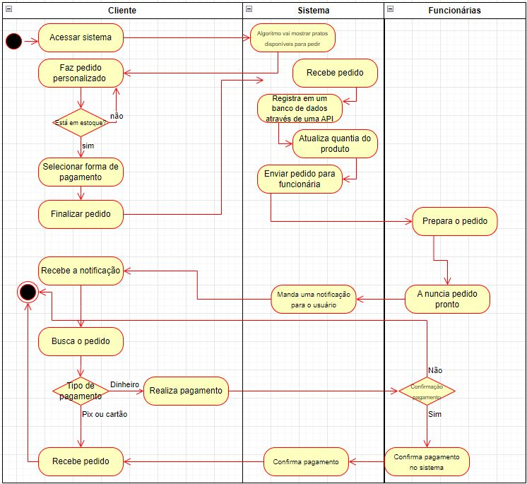

# Diagrama de Atividades

No dia 29 de Março, foi proposto uma atividade pela Professora Ana, envolvendo Diagrama de Atividades, o objetivo era criar um sistema similar ao ifood, dito isso, a atividade foi realizada por mim, Nícolas e Vinicius.

