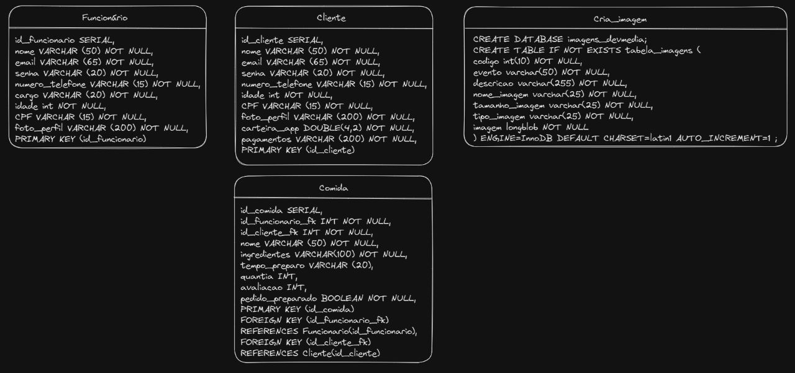

# Banco de dados do Gourmet Express

### Com o desenvolvimento do projeto do aplicativo para Mundo SENAI, é preciso um SGBD para armazenar dados sobre usuários do aplicativo.

#### Com o PostgreSQL, vou simular um Banco de Dados fictício porém próximo ao o que seria implementado no app:

~~~postgresql
CREATE TABLE Cliente (
    id_cliente SERIAL,
    nome VARCHAR (50) NOT NULL,
    email VARCHAR (65) NOT NULL,
    senha VARCHAR (20) NOT NULL,
    numero_telefone VARCHAR (15) NOT NULL,
    idade int NOT NULL,
    CPF VARCHAR (15) NOT NULL,
    foto_perfil VARCHAR (200) NOT NULL,
    carteira_app DOUBLE(4,2) NOT NULL,
    pagamentos VARCHAR (200) NOT NULL,
    PRIMARY KEY (id_cliente)
);

CREATE TABLE Funcionario (
    id_funcionario SERIAL,
    nome VARCHAR (50) NOT NULL,
    email VARCHAR (65) NOT NULL,
    senha VARCHAR (20) NOT NULL,
    numero_telefone VARCHAR (15) NOT NULL,
    cargo VARCHAR (20) NOT NULL,
    idade int NOT NULL,
    CPF VARCHAR (15) NOT NULL,
    foto_perfil VARCHAR (200) NOT NULL,
    PRIMARY KEY (id_funcionario)
);

CREATE TABLE Comida (
    id_comida SERIAL,
    id_funcionario_fk INT NOT NULL,
    id_cliente_fk INT NOT NULL,
    nome VARCHAR (50) NOT NULL,
    ingredientes VARCHAR(100) NOT NULL,
    tempo_preparo VARCHAR (20),
    quantia INT,
    avaliacao INT,
    pedido_preparado BOOLEAN NOT NULL,
    PRIMARY KEY (id_comida),
    FOREIGN KEY (id_funcionario_fk)
    REFERENCES Funcionario(id_funcionario),
    FOREIGN KEY (id_cliente_fk)
    REFERENCES Cliente(id_cliente)
);

CREATE TABLE Cria_imagem (
    CREATE DATABASE imagens_devmedia;
    CREATE TABLE IF NOT EXISTS tabela_imagens (
        codigo int(10) NOT NULL,
        evento varchar(50) NOT NULL,
        descricao varchar(255) NOT NULL,
        nome_imagem varchar(25) NOT NULL,
        tamanho_imagem varchar(25) NOT NULL,
        tipo_imagem varchar(25) NOT NULL,
        imagem longblob NOT NULL
    ) ENGINE=InnoDB DEFAULT CHARSET=latin1 AUTO_INCREMENT=1;
);
~~~

# Desenho de planejamento (https://excalidraw.com)

